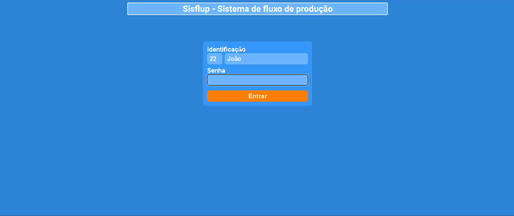

# 🚀 Portfólio - Renato Saldanha

<div align="center">
  
  
  ### Desenvolvedor Full Stack | Delphi | React | React Native
  
  [](https://linkedin.com/in/renato-saldanha)
  [](https://github.com/renato-saldanha)
  [](mailto:contato@renatosaldanha.com)
</div>

---

## 📋 Sobre o Projeto

Este é meu portfólio pessoal desenvolvido com **Next.js** e **TypeScript**, apresentando minha jornada profissional, projetos e habilidades técnicas. O site é responsivo, moderno e otimizado para performance.

### ✨ Características

- 🎨 **Design Moderno**: Interface limpa e profissional com animações suaves
- 📱 **Responsivo**: Funciona perfeitamente em desktop, tablet e mobile
- ⚡ **Performance**: Otimizado com Next.js e lazy loading
- 🎭 **Animações**: Transições fluidas com Framer Motion
- 📧 **Contato Integrado**: Formulário de contato funcional com EmailJS
- 🖼️ **Galeria Interativa**: Carrossel de projetos com controles intuitivos

---

## 🛠️ Tecnologias Utilizadas

### Frontend
- **Next.js 14** - Framework React para produção
- **TypeScript** - Tipagem estática para JavaScript
- **Tailwind CSS** - Framework CSS utilitário
- **Framer Motion** - Biblioteca de animações
- **Embla Carousel** - Carrossel responsivo
- **Lucide React** - Ícones modernos

### Ferramentas
- **EmailJS** - Integração de formulário de contato
- **Radix UI** - Componentes acessíveis
- **Class Variance Authority** - Gerenciamento de variantes de componentes

---

## 🚀 Como Executar

### Pré-requisitos
- Node.js 18+ 
- npm ou yarn

### Instalação

1. **Clone o repositório**
   ```bash
   git clone https://github.com/renato-saldanha/portfolio.git
   cd portfolio
   ```

2. **Instale as dependências**
   ```bash
   npm install
   # ou
   yarn install
   ```

3. **Configure as variáveis de ambiente**
   ```bash
   cp .env.example .env.local
   ```
   
   Adicione suas credenciais do EmailJS:
   ```env
   NEXT_PUBLIC_EMAILJS_SERVICE_ID=seu_service_id
   NEXT_PUBLIC_EMAILJS_TEMPLATE_ID=seu_template_id
   NEXT_PUBLIC_EMAILJS_PUBLIC_KEY=sua_public_key
   ```

4. **Execute o projeto**
   ```bash
   npm run dev
   # ou
   yarn dev
   ```

5. **Acesse o projeto**
   Abra [http://localhost:3000](http://localhost:3000) no seu navegador

### Scripts Disponíveis

```bash
npm run dev          # Executa em modo desenvolvimento
npm run build        # Gera build de produção
npm run start        # Executa build de produção
npm run lint         # Executa linting do código
```

---

## 📁 Estrutura do Projeto

```
src/
├── components/          # Componentes reutilizáveis
│   ├── Header/         # Cabeçalho da aplicação
│   ├── Footer/         # Rodapé da aplicação
│   ├── SocialBar/      # Barra de redes sociais
│   ├── GaleriaFotos/   # Componente de galeria
│   └── ui/             # Componentes UI base
├── pages/              # Páginas da aplicação
│   ├── Home/           # Página inicial
│   ├── Sobre/          # Página sobre
│   ├── Portifolio/     # Página de portfólio
│   └── Contato/        # Página de contato
├── styles/             # Estilos globais
├── uteis/              # Utilitários e interfaces
└── lib/                # Bibliotecas e configurações
```

---

## 👨‍💻 Sobre Mim

### Formação
- **Análise e Desenvolvimento de Sistemas** (2018)
- **Natural de Cuiabá-MT**

### Experiência Profissional
- **Desenvolvedor Full Stack** desde 2015
- **Especialista em Delphi** - Desenvolvimento desktop
- **React & React Native** - Desenvolvimento web e mobile
- **Manutenção de Computadores** - Experiência desde 2017

### Habilidades Técnicas

#### 🖥️ Desktop
- **Delphi** - Desenvolvimento de aplicações desktop
- **Banco de Dados** - SQL Server, PostgreSQL

#### 🌐 Web
- **React.js** - Desenvolvimento frontend
- **Next.js** - Framework React para produção
- **TypeScript** - Tipagem estática
- **Tailwind CSS** - Estilização

#### 📱 Mobile
- **React Native** - Desenvolvimento mobile
- **Aplicações híbridas**

#### 🛠️ Ferramentas
- **Git** - Controle de versão
- **VS Code** - Editor de código
- **Figma** - Design de interfaces

---

## 📂 Projetos em Destaque

### 🏭 Sistema Sisflup
**Sistema de Gerenciamento de Fluxo de Produção**

- **Tecnologias**: Delphi, SQL Server
- **Funcionalidades**:
  - Cadastro de clientes e orçamentos
  - Gerenciamento de fluxo de produção
  - Controle de etapas configuráveis
  - Relatórios e dashboards



---

## 📞 Contato

Estou sempre aberto a novas oportunidades e desafios! Entre em contato comigo:

- **Email**: [ranalisesaldanha@gmail.com](mailto:contato@renatosaldanha.com)
- **LinkedIn**: [Renato Saldanha](https://linkedin.com/in/renato-saldanha)

---

## 📄 Licença

Este projeto está sob a licença MIT. Veja o arquivo [LICENSE](LICENSE) para mais detalhes.

---

<div align="center">
  <p>Feito com ❤️ por <strong>Renato Saldanha</strong></p>
  <p>Última atualização: Dezembro 2024</p>
</div>
